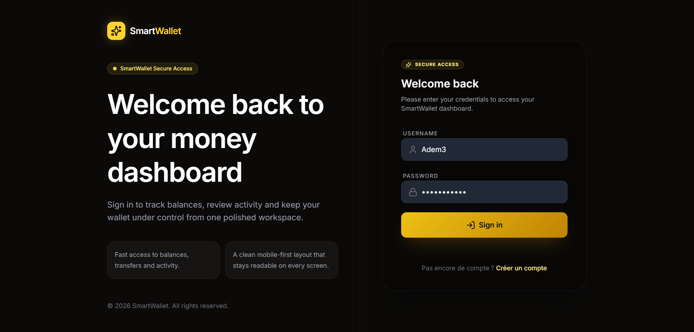
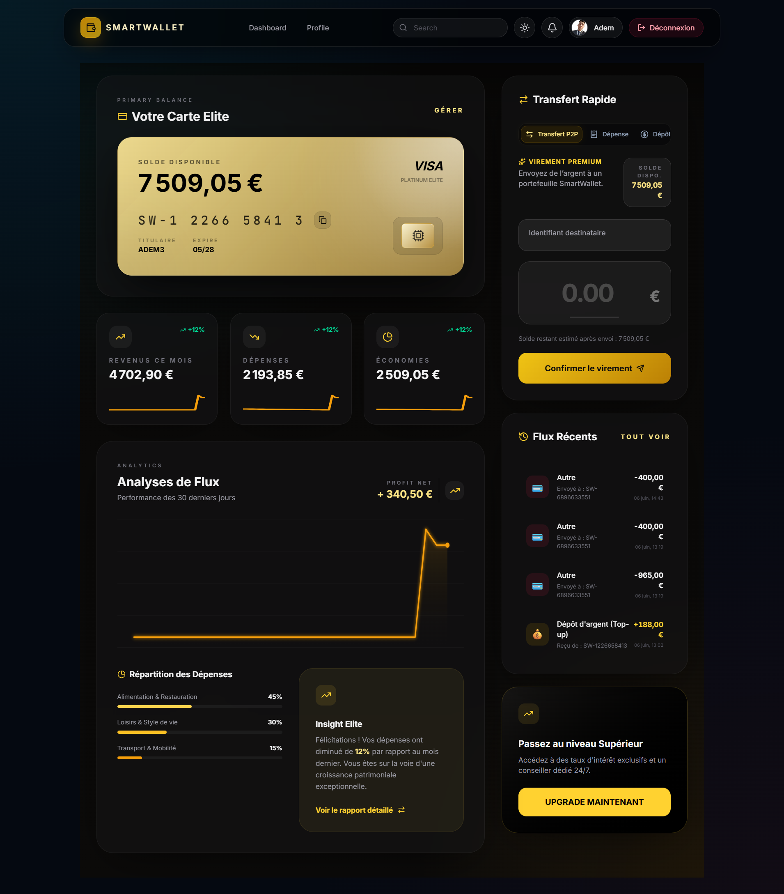

# 💎 Smart Wallet - The Elite Financial Hub

[](https://spring.io/projects/spring-boot)
[](https://reactjs.org/)
[](https://stomp.github.io/)
[](LICENSE)

> **L'élégance technologique au service de votre patrimoine.** Smart Wallet est une plateforme de gestion financière "Financial Elite" conçue pour offrir une expérience temps réel fluide, sécurisée et analytique.

---

## 🚀 Vision & Expérience Utilisateur

Smart Wallet redéfinit la gestion de portefeuille avec une interface ultra-premium et une réactivité instantanée. Chaque mouvement de fonds, chaque notification et chaque graphique est synchronisé en millisecondes grâce à une architecture événementielle de pointe.

### 🔐 Accès Sécurisé & Onboarding
L'entrée dans l'écosystème Smart Wallet est protégée par un protocole d'authentification robuste basé sur les **JSON Web Tokens (JWT)**.


*Une interface d'accueil épurée invitant à l'excellence financière.*


*Authentification biométrique simulée et sécurisation JWT par paliers.*

---

## 📊 Core Features: Le Dashboard Financier

Le cœur de l'application centralise vos actifs avec une précision chirurgicale.



*   **💳 Carte Premium Virtuelle :** Visualisez votre solde avec un design "Ultra Dark" élégant.
*   **📈 Graphique Analytique Dynamique :** Visualisation SVG interactive de vos flux de revenus et dépenses, mise à jour sans rechargement de page.
*   **⚡ Formulaire d'Action Hybride :** Une interface unique pour exécuter vos opérations critiques :
    *   **Dépôt :** Alimentation instantanée du compte.
    *   **Dépense :** Catégorisation intelligente des sorties.
    *   **Transfert P2P :** Envoi de fonds entre utilisateurs sécurisé par validation transactionnelle.

---

## 🛠 Architecture Technique & Temps Réel

L'excellence de Smart Wallet repose sur une stack technique optimisée pour la performance et la sécurité des données.

### 🏗 Backend (Spring Boot & Kotlin Mix)
Le serveur gère la logique métier complexe et la persistance avec une efficacité maximale.
*   **STOMP Security :** Utilisation d'un `ChannelInterceptor` pour intercepter les trames `CONNECT`. Chaque connexion WebSocket est validée par le token JWT avant d'autoriser l'accès au flux de données.
*   **Gestion Transactionnelle :** Intégrité totale des transferts P2P avec rollback automatique en cas d'erreur.
*   **Communication Asynchrone :** Utilisation d'événements pour le dispatching des notifications sans bloquer le thread principal.

### 💻 Frontend (React & TypeScript)
Une SPA (Single Page Application) réactive focalisée sur l'expérience utilisateur.
*   **STOMP Client & SockJS :** Abstraction de la complexité des WebSockets pour une communication bidirectionnelle stable.
*   **Synchronisation `useRef` :** Implémentation d'une barrière de synchronisation via `useRef` pour neutraliser les **Update Storms** (boucles de re-rendus infinis lors de la réception massive de trames STOMP), garantissant une fluidité de 60 FPS même en pic d'activité.

---

## 💎 Modules Avancés

*   **🔔 Notifications Temps Réel :** Système d'alertes intégré dans la barre de navigation (Toast & Dropdown) pour chaque mouvement de compte.
*   **📑 Historique Multicritère :** Filtres avancés par catégories (Alimentation, Loisirs, Salaire, etc.) et par types de transactions (Débit/Crédit).
*   **📥 Extraction de Données :** Module d'exportation vers format **CSV** pour une analyse externe de votre patrimoine.

---

## ⚙️ Installation & Lancement

Suivez ces étapes pour déployer votre hub financier localement.

### 🔙 Backend (API)
Le serveur écoute sur le port **8081**.
```bash
cd smart-wallet-api
# Compilation mixte Java/Kotlin et lancement
./mvnw clean kotlin:compile compile spring-boot:run
```

### 🔜 Frontend (UI)
L'interface est propulsée par Vite sur le port **5173**.
```bash
cd smart-wallet-ui
npm install
npm run dev
```

---

## 👔 Portfolio & Crédits
Développé avec passion pour démontrer la puissance des architectures modernes **Spring Boot / React**. 

*   **Lead Technical Writer & DevOps :** Gemini CLI Agent
*   **Design Language :** Ultra Dark Premium / Financial Elite

---
© 2026 Smart Wallet Project. All rights reserved.
